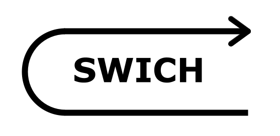

# Swich
> Switch but with a typo

[](https://circleci.com/gh/Lukasz-pluszczewski/swich)
[](https://codecov.io/gh/Lukasz-pluszczewski/swich)

<h1>
  <a href="https://github.com/Lukasz-pluszczewski/swich">
    
  </a>
</h1>

## Getting started
### Install the library
`npm i swich`

### Simple usage
Swich function accepts an array of [*Pattern*, *Result*] tuples. *Pattern* can be any value or custom compare function that returns any value. *Result* can be any value that is going to be returned or a function that is going to be executed (and the return value returned). See [Usage examples](#usage-examples) and [API](#api) below to learn more.

Swich returns function that accepts *Value* that is to be compared with *Patterns*.

```js
import swich from 'swich';

const instance = swich([
  ['foo', 'This is foo'],
  ['bar', 'This is bar'],
  ['This is default'],
]);

instance('foo'); // 'This is foo'
instance('bar'); // 'This is bar'
instance('Lorem ipsum'); // 'This is default'
```

## Table of contents
- [Getting started](#getting-started)
  * [Install the library](#install-the-library)
  * [Simple usage](#simple-usage)
- [Table of contents](#table-of-contents)
- [Usage examples](#usage-examples)
  * [Simple matching](#simple-matching)
  * [Pattern matching](#pattern-matching)
  * [Custom compare functions](#custom-compare-functions)
  * [Comparison with true](#comparison-with-true)
  * [Multiple defaults](#multiple-defaults)
  * [Returning all matches instead of first](#returning-all-matches-instead-of-first)
  * [Non-strict equality](#non-strict-equality)
  * [Accepting truthy *Pattern* function return](#accepting-truthy--pattern--function-return)
  * [Catching *Pattern* function errors](#catching--pattern--function-errors)
  * [Perform regex replace on return value](#perform-regex-replace-on-return-value)
  * [Calling the *Result* function](#calling-the--result--function)
  * [createSwich function](#createswich-function)
  * [Custom matchers](#custom-matchers)
  * [Custom result getters](#custom-result-getters)
  * [Comparator functions](#comparator-functions)
  * [Fallthrough](#fallthrough)
- [API](#api)
  * [swich](#swich)
  * [createSwich](#createswich)
  * [Config](#config)
- [Development](#development)
- [Changelog](#changelog)

## Usage examples

### Simple matching
```js
const instance = swich([
  ['foo', 'This is foo'],
  ['bar', 'This is bar'],
  ['This is default'],
]);

instance('foo'); // 'This is foo'
instance('bar'); // 'This is bar'
instance('Lorem ipsum'); // 'This is default'
```

### Pattern matching
You can use RegExp as *Patterns*. They are going to be matched against provided *Value* (non-string values matching against regex always results in false - no errors are thrown)
```js
const instance = swich([
  [/fo./, 'This is foo'],
  [/.ar/, 'This is bar'],
  ['This is default'],
]);

instance('foo'); // 'This is foo'
instance('xar'); // 'This is bar'
instance('Lorem ipsum'); // 'This is default'
```

### Custom compare functions
If the *Pattern* is a function it's going to be called with provided *Value*. Matching succeeds when the function returns truthy value.
```js
const instance = swich([
  [1, 'This is one'],
  [2, 'This is two'],
  [value => value > 2, 'This is more than two'],
  ['This is default'],
]);

instance(1); // 'This is one'
instance(2); // 'This is two'
instance(10); // 'This is more than two'
instance(-2); // 'This is default'
instance('Lorem ipsum'); // 'This is default'
```

### Comparison with true
If you don't pass any *Value*, true is assumed by default. It mimics the `switch(true)` pattern.
```js
const value = 'foo';
const instance = swich([
  [value === foo, 'This is foo'],
  [value === bar, 'This is bar'],
  ['This is default'],
])(); // 'This is foo'
```

### Multiple defaults
By default (`returnMany: false`, see below) only the first match (if not falling through) or last default is returned. In the case below, 'This is default 1' will never be returned.

```js
const instance = swich([
  [foo, 'This is foo'],
  [bar, 'This is bar'],
  ['This is default 1'],
  ['This is default 2'],
]);

instance('xyz'); // 'This is default 2'
```

### Returning all matches instead of first
When `returnMany` flag is set to true, all matches are returned (or all defaults if no matches found)
```js
const instance = swich([
  [value => value < 3, 'This is less than three'],
  [value => value > 2, 'This is more than two'],
], { returnMany: true });

instance(5); // ['This is more than two']
instance(2.5); // ['This is less than three', 'This is more than two']
```

```js
const instance = swich([
  [/ab./, 'This is ab'],
  [/.bc/, 'This is bc'],
  ['Default 1'],
  ['Default 2'],
], { returnMany: true });

instance('abx'); // ['This is ab']
instance('abc'); // ['This is ab', 'This is bc']
instance('xyz'); // ['Default 1', 'Default 2']
```

### Non-strict equality
By default, swich performs strict equality check between *Pattern* and *Value*. You can set `strict` flag to false to change that behaviour.
```js
const instance = swich([
  ['1', 'This is one'],
  ['2', 'This is two'],
], { strict: false });

instance(1); // 'This is one'
instance(2); // 'This is two'
```

### Accepting truthy *Pattern* function return
By default, matching succeeds when the function returns truthy value. You can change that behaviour by setting `acceptTruthyFunctionReturn` to false. Then all values except `true` are treated as falsy.
```js
const instance = swich([
  [value => value, 'This is truthy'],
  [value => !value, 'This is falsy'],
]);

instance(1); // 'This is truthy'
instance(0); // 'This is falsy'
```

```js
const instance = swich([
  [value => value, 'This is truthy'],
  ['Default'],
], { acceptTruthyFunctionReturn: false });

instance(1); // 'Default' // Truthy value is not accepted
instance(true); // 'This is truthy' // True is accepted
```


### Catching *Pattern* function errors
By default, all errors thrown in *Pattern* function are caught. You can change that behaviour by setting `catchFunctionErrors` to false.
```js
const obj = { foo: { isTrue: true } };
const instance = swich([
  [value => obj[value].isTrue, 'This is foo'],
  ['This is not foo'],
]);

instance('foo'); // 'This is foo'
instance('bar'); // 'This is not foo'
```

```js
const instance = swich([
  [value => obj[value].isTrue, 'This is foo'],
  ['This is not foo'],
], { catchFunctionErrors: false });

instance('foo'); // 'This is foo'
instance('bar'); // Uncaught TypeError: Cannot read property 'isTrue' of undefined
```

### Perform regex replace on return value
You can use params from regex matching and put them in result. To enable that feature set `performReplaceOnRegex` flag to true.
```js
const instance = swich([
  [/I am (.+)/, 'Their name is $1'],
  ['I don\'t know their name'],
], { performReplaceOnRegex: true });

instance('I am John'); // 'Their name is John'
instance('Uga buga'); // 'I don\'t know their name'
```


### Calling the *Result* function
By default, if *Result* is a function it's going to be called with *Value* and it's return value is going to be returned. This partly mimics the usual usage of switch stricture.

You can disable this feature, and just return *Result* function as value, by setting `runResultFunction` flag to false.
```js
import swich, { gt, lt } from 'swich';

const instance = swich([
  [gt(50), () => {
    console.log('More than 50');
  }],
  [lt(0), () => {
    console.log('Less than 0');
  }],
  [() => {
    console.log('Between 0 and 50');
  }],
]);

instance(120); // More than 50
instance(-20); // Less than 0
instance(20); // Between 0 and 50
```

```js
import swich, { gt, lt } from 'swich';

const instance = swich([
  [gt(50), value => {
    return value / 2;
  }],
  [lt(0), value => {
    return value + 10;
  }],
  [value => {
    return value;
  }],
]);

instance(120); // 60
instance(-20); // -10
instance(20); // 20
```

### createSwich function
createSwich factory allows you to create a custom swich with different defaults. It accepts the same config object as swich function so you can overwrite your overwrites :)
```js
import { createSwich } from 'swich';

const customSwich = createSwich({
  performReplaceOnRegex: true,
  catchFunctionErrors: false,
});
const instance = swich([
  [/I am (.+)/, 'Their name is $1'],
  [value => value.foo.bar.isTrue, 'This is foo'],
  ['I don\'t know their name'],
], { catchFunctionErrors: true });

instance('I am John'); // 'Their name is John'
instance('Uga buga'); // 'I don\'t know their name'
```

### Custom matchers
You can define your own *Pattern* matcher.
```js
import { createSwich, defaultMatcher } from 'swich';

const swich = createSwich({
  matcher: config => (valueToMatch, pattern) => typeof pattern === 'object'
   ? pattern?.type === valueToMatch?.type
   : defaultMatcher(config)(valueToMatch, pattern),
});
const instance = swich([
  [{ type: 'foo' }, 'Type is foo'],
  [{ type: 'bar' }, 'Type is bar'],
  ['Unknown type'],
]);

instance({ type: 'foo' }); // 'Type is foo'
instance({ type: 'bar' }); // 'Type is bar'
instance('Uga buga'); // 'Unknown type'
```

### Custom result getters
You can define your own resultGetter that is going to be used to get the value to be returned.
```js
import { createSwich, defaultResultGetter } from 'swich';

const swich = createSwich({
  resultGetter: (config) => (valueToMatch, pattern, result) =>
    defaultResultGetter(config)(valueToMatch, pattern, typeof result === 'object' ? result.value : result),
});
const instance = swich([
  ['foo', { value: 'Type is foo' }],
  ['bar', { value: 'Type is bar' }],
  ['Unknown type'],
]);

instance('foo'); // 'Type is foo'
instance('bar'); // 'Type is bar'
instance('Uga buga'); // 'Unknown type'
```

### Fallthrough
Swich supports fallthrough functionality since version 1.1.0

You can force the case fallthrough by passing `true` as third element of pattern tuple. This is equivalent to *not* adding break keyword at the end of case in switch.
```js
const instance = swich([
  [lt(10), () => console.log('Less than 10'), true],
  [gt(5), () => console.log('More than 5')],
  [() => console.log('I am default')],
]);

instance(6); // 'Less than 10' 'More than 5'
```

Please note, that by default swich will fall through to the next *Result* even if *Pattern* for that result **does not match**. This is the same behaviour as switch:
```js
const instance = swich([
  [lt(10), () => console.log('Less than 10'), true],
  [gt(5), () => console.log('More than 5')],
  [() => console.log('I am default')],
]);

instance(2); // 'Less than 10' 'More than 5'
```

Swich will fall through even to default *Result*, the same as switch. In the following example all *Result* functions are called:
```js
const instance = swich([
  [lt(10), () => console.log('Less than 10'), true],
  [gt(5), () => console.log('More than 5'), true],
  [() => console.log('I am default')],
]);

instance(2); // 'Less than 10' 'More than 5' 'I am default'
```

### Fallthrough with stopFallThrough flag
Because the default behaviour for switch (and swich) is ridicules you can set stopFallThrough flag to true to change it. With that flag, the fallthrough will not return or trigger *Result* if *Pattern* does not match the *Value*. Non-matching *Pattern* will also stop the fall through on that element.

```js
const instance = swich([
  [lt(10), () => console.log('Less than 10'), true],
  [gt(5), () => console.log('More than 5'), true],
  [() => console.log('I am default')],
], { stopFallThrough: true });

instance(2); // 'Less than 10'
```

### Fallthrough with returnMany flag
```js
const instance = swich([
  [lt(10), () => 'Less than 10', true],
  [gt(5), () => 'More than 5', true],
  [() => 'I am default'],
], { returnMany: true });

instance(2); // ['Less than 10', 'More than 5', 'I am default']
```

```js
const instance = swich<number, string>([
  [lt(10), () => 'Less than 10', true],
  [gt(5), () => 'More than 5', true],
  [gt(1), () => 'More than 1', true],
  [() => 'I am default'],
], { returnMany: true });

instance(2); // ['Less than 10', 'More than 5', 'More than 1', 'I am default']
```

```js
const instance = swich<number, string>([
  [lt(10), () => 'Less than 10', true],
  [gt(5), () => 'More than 5', true],
  [gt(1), () => 'More than 1'],
  [() => 'I am default'],
], { returnMany: true });

instance(2); // ['Less than 10', 'More than 5', 'More than 1']
```

### Fallthrough with stopFallThrough and returnMany flags
stopFallThrough flag prevents swich from falling into default:
```js
const instance = swich([
  [lt(10), () => 'Less than 10', true],
  [gt(5), () => 'More than 5', true],
  [() => 'I am default'],
], { returnMany: true, stopFallThrough: true });

instance(2); // ['Less than 10']
```

Here, swich falls through to default, because *Pattern* right before it has been matched
```js
const instance = swich<number, string>([
  [lt(10), () => 'Less than 10', true],
  [gt(5), () => 'More than 5', true],
  [gt(1), () => 'More than 1', true],
  [() => 'I am default'],
], { returnMany: true, stopFallThrough: true });

instance(2); // ['Less than 10', 'More than 1', 'I am default']
```

### Comparator functions
Four functions for number comparisons are provided
```js
import swich { lt, lte, gt, gte } from 'swich';

swich([
  [lt(10), 'Less than 10'],
])(5); // 'Less than 10'

swich([
  [lte(10), 'Less than or equal 10'],
])(10); // 'Less than or equal 10'

swich([
  [gt(10), 'More than 15'],
])(15); // 'More than 15'

swich([
  [gte(20), 'More than or equal 20'],
])(20); // 'More than or equal 20'
```

## API
### swich
swich function accepts two parameters: array of *Pattern*, *Result* tuples and *Config*.
- **patterns results pairs**: *array* array of pattern result tuples
  - **pattern**: *any* Pattern to match *Value* with. Can also be a matching function that accepts *Value* as an argument and return boolean (or truthy value if `acceptTruthyFunctionReturn` is set to true which is default). Errors in *Pattern* function are caught by default (itt can be changed with `catchFunctionErrors` flag in config)
  - **result**: *any* value to be returned or function to be called when *Pattern* matches *Value*
- **config**: *object* (optional) see below
- ***Return value***: *function* function that accepts *Value* to be matched against *Patterns*

### createSwich
- **config**: *object* (optional) see below
- ***Return value***: *function* function that accepts *Value* to be matched against *Patterns*

### Config
- **returnMany**: *boolean* (default: false) if set to true all matches (or all defaults if nothing matches) are going to be called (returned) ([example](#returning-all-matches-instead-of-first))
- **strict**: *boolean* (default: true) indicates if strict equality comparison should be used when matching *Value* against *Patterns* (loose quality performed when set to false) ([example](#non-strict-equality))
- **acceptTruthyFunctionReturn**: *boolean* (default: true) if set to true, all truthy values returned from *Pattern* function will be treated as true, otherwise everything other than true is treated as false ([example](#accepting-truthy--pattern--function-return))
- **catchFunctionErrors**: *boolean* (default: true) flag indicating if errors thrown in *Pattern* function should be automatically caught ([example](#catching--pattern--function-errors))
- **performReplaceOnRegex**: *boolean* (default: false) if set to true, regex params are going to be inserted in result strings (see [example](#perform-regex-replace-on-return-value))
- **runResultFunction**: *boolean* ([example](#calling-the--result--function))
- **matcher**: *function* custom matcher ([example](#custom-matchers))
- **resultGetter**: *function* custom result getter ([example](#custom-result-getters))

## Development
- Clone the repository
- `npm i`

**Running tests**
`npm run test`

**Starting demo app**
`npm run demo`

## Changelog

### 1.1.0
- Added fallThrough functionality

### 1.0.0
- Initial release
